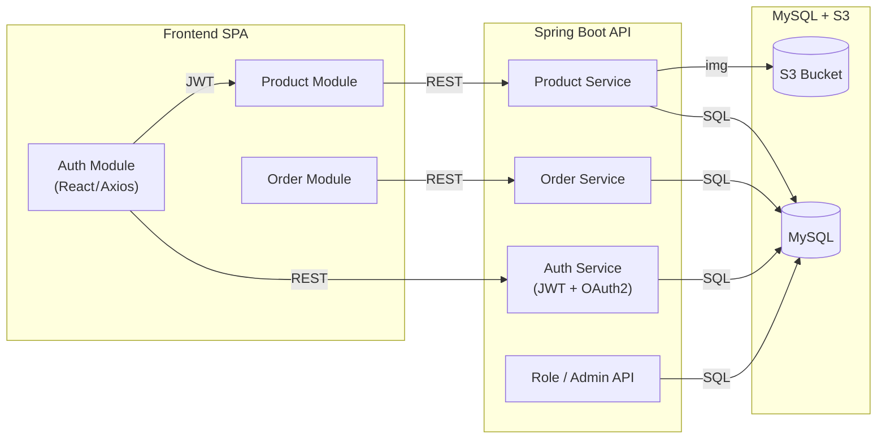
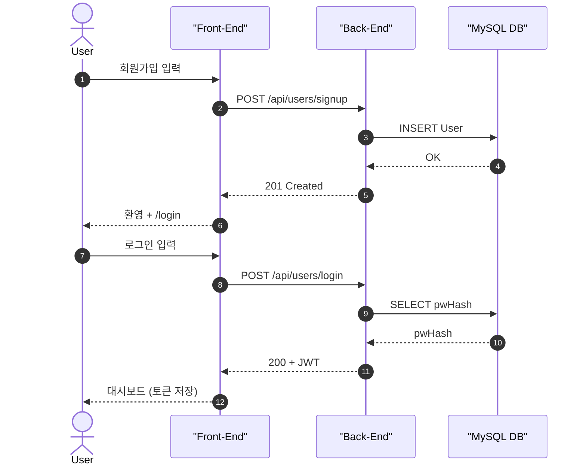
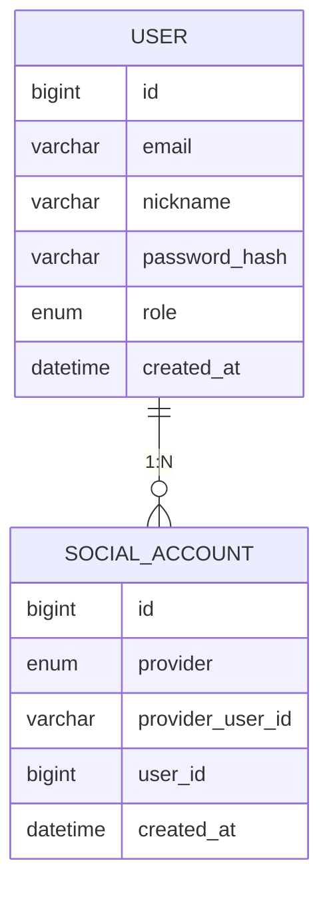
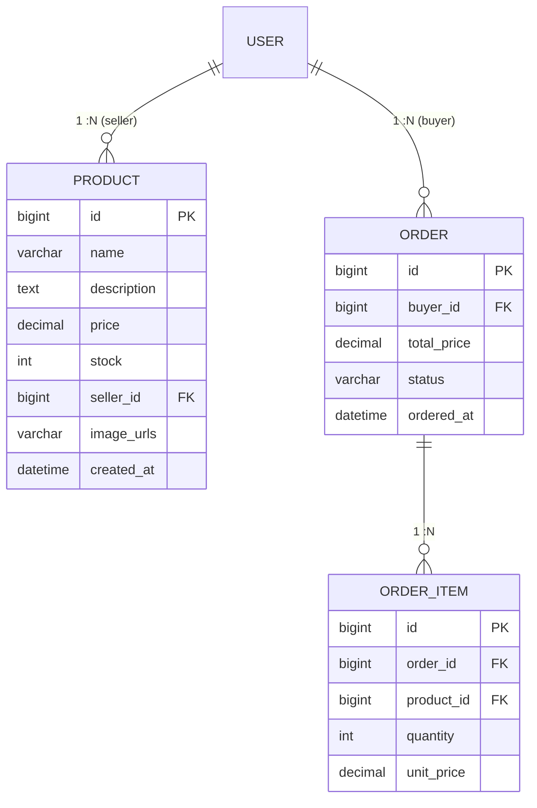
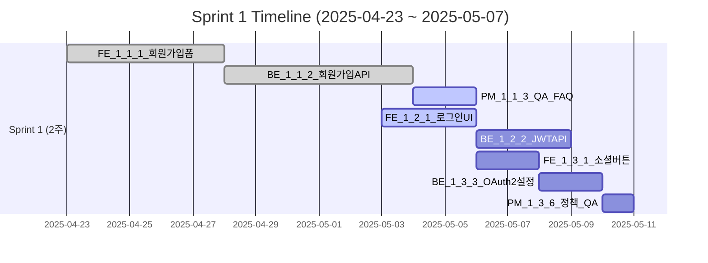

# 📊 Wappenable 시각화 – Epic / Story / Task / ERD

| 구분 | 다이어그램 | 설명 |
|------|-----------|------|
| **1** | Flowchart | Epic 모듈·데이터 흐름 |
| **2** | Sequence | Story 1.x (회원가입·로그인) 클/서 동선 |
| **3** | ERD | 인증 & 커머스 도메인 모델 |
| **4** | Gantt | Sprint 1·2 Task 일정 |

> **미리보기** VS Code(<em>Markdown Preview Mermaid Support</em>)·GitHub·Notion 등 Mermaid 지원 뷰어에서 확인하세요.

---

## Epic 레벨 Flowchart (모듈·데이터 흐름)

---
## Epic 1 – Story 1.x Sequence Diagram

---
## Epic 1 – 인증 ERD

---
## Epic 2 – 커머스 ERD

---
## Sprint 1 (2025-04-23 ~ 2025-05-07) Gantt

